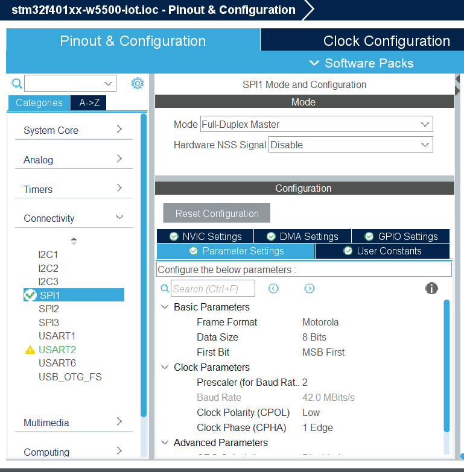
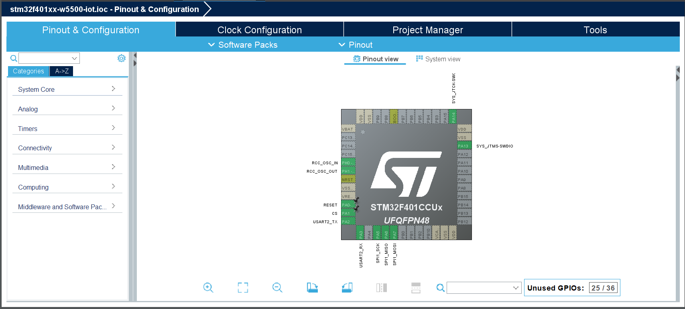
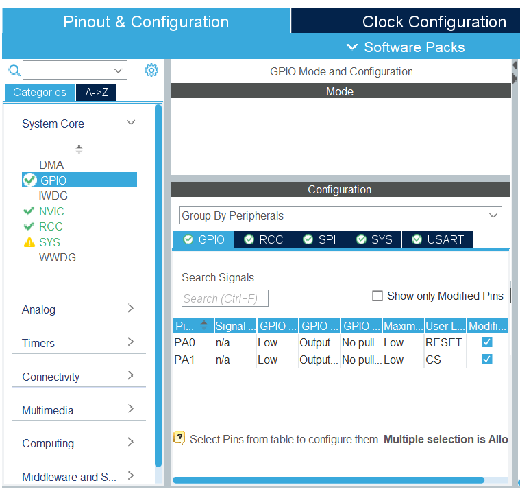
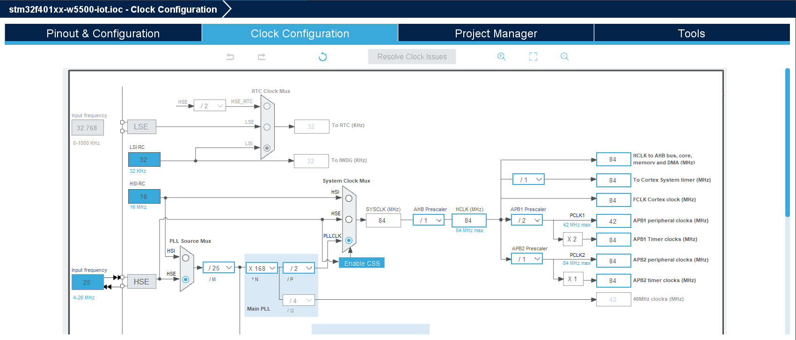
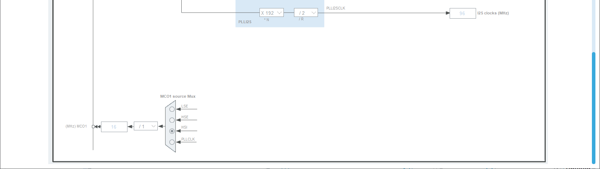
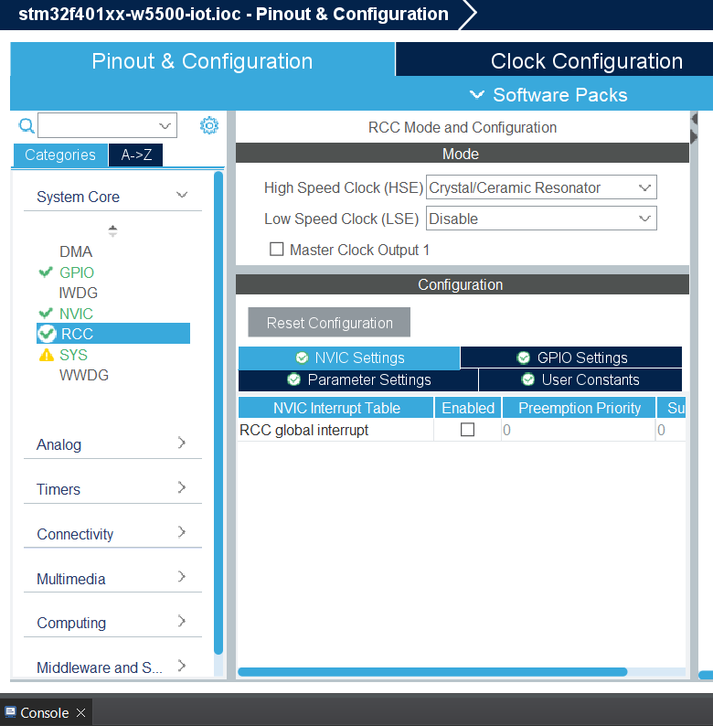
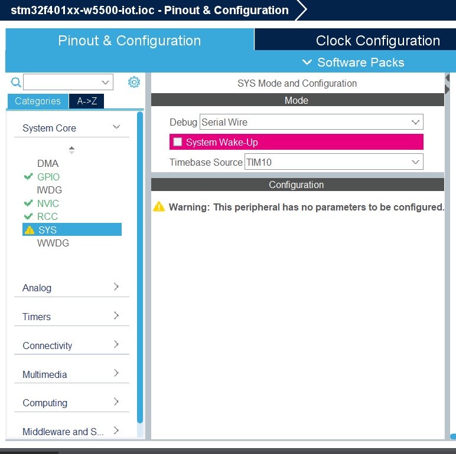

# STM32F401xx-W5500 IoT
Programming Ethernet Connection using STM32F401

---

## 📋 Overview

Project ini adalah tutorial untuk menghubungkan **STM32F401 Development Board** dengan **W5500 Ethernet Module** untuk komunikasi jaringan Ethernet. W5500 adalah hardwired TCP/IP chip yang memudahkan implementasi koneksi internet pada embedded systems.

**Key Features:**
- ✅ Hardware Ethernet Controller (W5500)
- ✅ SPI Communication Interface
- ✅ Support TCP/IP Protocol Stack
- ✅ DHCP Client Support
- ✅ Up to 8 Independent Sockets
- ✅ UART Debug Interface

---

## 📦 Required Devices

### **Hardware Components**

| Component | Specification | Quantity |
|-----------|---------------|----------|
| **STM32F401 Development Board** | STM32F401CCU6 or STM32F401RET6 | 1 pc |
| **W5500 Ethernet Module** | WIZnet W5500 Chip | 1 pc |
| **Ethernet Cable** | Cat5e/Cat6 RJ45 | 1 pc |
| **USB to Serial/TTL** | For debugging (FT232) | 1 pc |
| **Jumper Wires** | Male-to-Female & Male-to-Male | 20+ pcs |
| **STM32 Uploader** | Uploader USB Power | 1 pc |

### **Device Specifications**

#### **STM32F401**
- **Processor:** ARM Cortex-M4 with FPU
- **Clock Speed:** Up to 84 MHz
- **Flash Memory:** 256 KB
- **SRAM:** 64 KB
- **Operating Voltage:** 1.8V to 3.6V
- **I/O Voltage:** 3.3V compatible

#### **W5500 Module**
- **Protocol Stack:** Hardwired TCP/IP (TCP, UDP, ICMP, IPv4, ARP, IGMP, PPPoE)
- **Number of Sockets:** 8 independent hardware sockets
- **Internal Buffer:** 32KB (16KB TX + 16KB RX)
- **Communication Interface:** SPI (Mode 0/3, up to 80MHz)
- **Operating Voltage:** 3.3V (**Important!**)
- **Network Speed:** 10/100 Mbps Auto-negotiation

---

## 🔌 Hardware Connection Schematic

### **Pin Mapping Table**

#### **SPI Communication**
| STM32F401 Pin | Pin Function | W5500 Module Pin | Description |
|---------------|--------------|------------------|-------------|
| **PA5** | SPI1_SCK | **SCK** | Serial Clock |
| **PA6** | SPI1_MISO | **SO** (MISO) | Master In Slave Out |
| **PA7** | SPI1_MOSI | **SI** (MOSI) | Master Out Slave In |
| **PA1** | GPIO Output | **CS** (SCS) | Chip Select - Active Low |
| **PA0** | GPIO Output | **RESET** (RST) | Hardware Reset - Active Low |
| *Not Connected* | - | **INT** | Interrupt (Optional) |

#### **UART Debug Interface**
| STM32F401 Pin | Pin Function | Connect to | Purpose |
|---------------|--------------|------------|---------|
| **PA2** | USART2_TX | USB-TTL RX Pin | Transmit debug data to PC |
| **PA3** | USART2_RX | USB-TTL TX Pin | Receive data from PC |

#### **Power Supply**
| STM32F401 | W5500 Module | Notes |
|-----------|--------------|-------|
| **3.3V** | **VCC** | Power supply 3.3V only |
| **GND** | **GND** | Common ground |

### **Connection Diagram**

Refer to the wiring schematic diagram below for visual reference:


### **Important Notes:**

⚠️ **Critical Warnings:**
1. **W5500 MUST use 3.3V power supply** - Never connect to 5V!
2. Ensure common ground between STM32 and W5500
3. CS (Chip Select) must be controlled by GPIO, not hardware SPI NSS
4. Keep SPI wires as short as possible for signal integrity
5. If using long wires, add 100nF decoupling capacitor near W5500 VCC pin

💡 **Tips:**
- Use breadboard jumper wires < 15cm for best results
- Connect W5500 module close to STM32 board
- INT pin is optional - can be left disconnected for polling mode
- For production, add 10kΩ pull-up resistor on RESET line

### **Physical Assembly Steps:**

1. **Mount Components**
   - Place STM32F401 board on breadboard
   - Place W5500 module on breadboard (leave space between modules)

2. **Power Connections First** (Important!)
   - Connect STM32 GND to breadboard ground rail
   - Connect STM32 3.3V to breadboard power rail
   - Connect W5500 GND to ground rail
   - Connect W5500 VCC to 3.3V power rail
   - **Verify voltage with multimeter before proceeding**

3. **SPI Signal Connections**
   - PA5 (SCK) → W5500 SCK
   - PA6 (MISO) → W5500 SO
   - PA7 (MOSI) → W5500 SI

4. **Control Signal Connections**
   - PA1 → W5500 CS
   - PA0 → W5500 RESET

5. **Debug UART** (Optional but recommended)
   - PA2 → USB-TTL RX
   - PA3 → USB-TTL TX
   - USB-TTL GND → Common ground

6. **Network Connection**
   - Connect Ethernet cable to W5500 RJ45 port
   - Connect other end to router/switch

---

## 🛠️ Software Installation

### **Step 1: Install Development Environment**

#### **STM32CubeIDE**
1. Download from official STMicroelectronics website:
   - URL: https://www.st.com/en/development-tools/stm32cubeide.html
2. Choose version for your OS:
   - Windows: `.exe` installer
   - Linux: `.sh` installer
   - macOS: `.dmg` installer
3. Install with default settings
4. **Recommended version:** STM32CubeIDE 1.13.0 or newer

#### **Serial Terminal Software**
Choose one for debugging:
- **Tera Term** (Windows) - https://ttssh2.osdn.jp/
- **PuTTY** (All platforms) - https://www.putty.org/
- **CoolTerm** (All platforms) - https://freeware.the-meiers.org/
- **screen** (Linux/macOS) - Built-in command line tool

### **Step 2: Download W5500 Library**

#### **WIZnet ioLibrary_Driver**

**Download Options:**

**Option A: Git Clone (Recommended)**
```bash
git clone https://github.com/Wiznet/ioLibrary_Driver.git
```

**Option B: Direct Download**
- URL: https://github.com/Wiznet/ioLibrary_Driver
- Click "Code" → "Download ZIP"
- Extract to your workspace

## ⚙️ STM32CubeIDE Project Configuration

### **📌 Part 1: Create New Project**

1. **Launch STM32CubeIDE**
   - File → New → STM32 Project

2. **Select Target**
   - Click "Board Selector" tab or "MCU/MPU Selector" tab
   - **For Board Selector:**
     - Type: `NUCLEO-F401RE` (if using Nucleo board)
   - **For MCU Selector:**
     - Search: `STM32F401CCU6` or `STM32F401RET6`
     - Select your exact MCU part number

3. **Project Settings**
   - Project Name: `STM32F401_W5500_Ethernet`
   - Targeted Language: `C`
   - Targeted Binary Type: `Executable`
   - Targeted Project Type: `STM32Cube`

4. Click **Finish**

---

### **📌 Part 2: Pinout Configuration**

Based on screenshots: `gpio_set`, `io`, `spi`, `uart`

#### **🔧 Configure SPI1**

**Configuration Screenshot:**



---

#### **🔧 Configure USART2 (Debug)**

**Configuration Screenshot:**


---

#### **🔧 Configure GPIO Pins**

**Configuration Screenshots:**




---

**Peripheral Clock Mapping:**
- **SPI1** runs on APB2 → 84 MHz
- **USART2** runs on APB1 → 42 MHz
- **GPIO** runs on AHB → 84 MHz

**Configuration Screenshots:**







---

## 🧪 Initial Testing

### **Test 1: Hardware Power Test**

1. **Visual Inspection:**
   - [ ] Check all wire connections
   - [ ] Verify no short circuits
   - [ ] Ensure proper orientation of modules

2. **Power On:**
   - [ ] Connect USB to STM32 board
   - [ ] W5500 power LED should turn on
   - [ ] STM32 power LED should turn on

3. **Measure Voltages:**
   - [ ] W5500 VCC pin: 3.3V (±0.1V)
   - [ ] STM32 3.3V pin: 3.3V (±0.1V)
   - [ ] Ground continuity verified

### **Test 2: Serial Communication Test**

1. **Connect USB-TTL:**
   - Connect to PC USB port
   - Drivers should install automatically

2. **Open Serial Terminal:**
   - Port: Select correct COM port
   - Baud rate: 115200
   - Data bits: 8
   - Parity: None
   - Stop bits: 1
   - Flow control: None

3. **Expected Result:**
   - Terminal should open without errors
   - Ready for debug messages

### **Test 3: Project Build Test**

1. **In STM32CubeIDE:**
   - Project → Build All
   - Or press `Ctrl + B`

2. **Expected Output:**
   ```
   Building target: STM32F401_W5500_Ethernet.elf
   Finished building target: STM32F401_W5500_Ethernet.elf
   
   arm-none-eabi-size  STM32F401_W5500_Ethernet.elf
      text    data     bss     dec     hex filename
      1234     100     500    1834     72a STM32F401_W5500_Ethernet.elf
   
   Build Finished. 0 errors, 0 warnings.
   ```

### **Test 4: Network Testing (After Implementation)**

Reference screenshots showing successful testing results:

**DHCP Configuration Test:**


**Packet Sender Communication Test:**


**Test Results:**


---

## 📚 Additional Resources

### **Official Documentation**

1. **W5500 Resources:**
   - Datasheet: https://www.wiznet.io/product-item/w5500/
   - User Manual: https://docs.wiznet.io/Product/iEthernet/W5500/overview
   - Driver Library: https://github.com/Wiznet/ioLibrary_Driver
   - Application Notes: https://docs.wiznet.io/

2. **STM32F401 Resources:**
   - Reference Manual (RM0368): https://www.st.com/resource/en/reference_manual/rm0368-stm32f401xbc-and-stm32f401xde-advanced-armbased-32bit-mcus-stmicroelectronics.pdf
   - Datasheet: https://www.st.com/en/microcontrollers-microprocessors/stm32f401.html
   - HAL User Manual: https://www.st.com/resource/en/user_manual/um1725-description-of-stm32f4-hal-and-lowlayer-drivers-stmicroelectronics.pdf

3. **STM32CubeIDE:**
   - User Guide: https://www.st.com/resource/en/user_manual/um2609-stm32cubeide-user-guide-stmicroelectronics.pdf
   - Getting Started: https://wiki.st.com/stm32mcu/wiki/STM32CubeIDE

### **Community & Support**

- **STM32 Community:** https://community.st.com/
- **WIZnet Forum:** https://forum.wiznet.io/
- **Stack Overflow:** Tag `stm32` and `w5500`
- **GitHub Discussions:** Search "STM32 W5500" for example projects

### **Development Tools**

- **Network Testing:**
  - Packet Sender: https://packetsender.com/
  - Hercules: https://www.hw-group.com/software/hercules-setup-utility
  - Wireshark: https://www.wireshark.org/

- **Serial Terminal:**
  - Tera Term: https://ttssh2.osdn.jp/
  - PuTTY: https://www.putty.org/
  - CoolTerm: https://freeware.the-meiers.org/

---


*This documentation focuses on hardware setup and STM32CubeIDE configuration. For code implementation examples, please refer to separate implementation guides.*